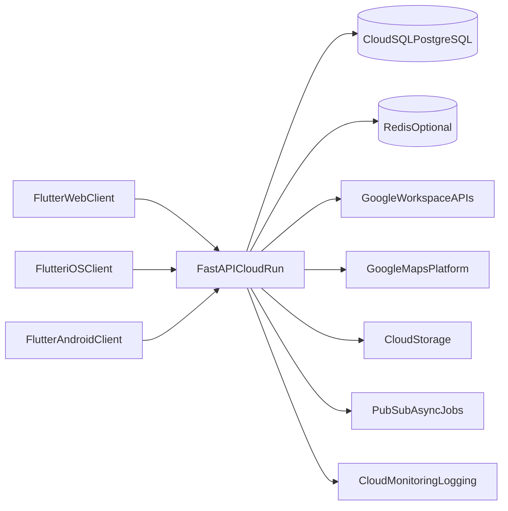

# Agent Tracker v2.0 - System Architecture

## 1) Architecture Overview

## 2) Client-Side Architecture (Flutter)

- `presentation` layer: screens/widgets/forms.
- `application` layer: use-cases, view-state orchestration.
- `domain` layer: strongly typed entities/enums/value objects.
- `data` layer: repositories, local DB adapters, REST adapters.
- Local persistence:
  - mobile: Drift/SQLite preferred for mature query/offline sync support
  - web: IndexedDB via Hive/Isar adapter for cache/session state

## 3) Backend Architecture (FastAPI)

- API Routers (`/api/v1/*`) by domain.
- Service layer for business rules.
- Repository layer for SQL access.
- Integration adapters per Google service.
- Background workers (Pub/Sub + Cloud Run jobs) for sync, exports, imports.

## 4) Communication Patterns

- Client -> API: HTTPS JSON REST.
- API -> Google APIs: OAuth delegated calls with stored refresh tokens.
- Async workloads:
  - report export generation
  - bulk seed imports
  - periodic sync pull jobs
- Idempotency keys required for create/update endpoints from offline clients.

## 5) Environments

- `dev`: local emulation + sandbox Google project.
- `staging`: production-like infra, masked data, integration testing.
- `prod`: hardened config, least-privilege service accounts, alerting.

## 6) Reliability and Performance Targets

- P95 API latency under 500ms for list/search endpoints at normal load.
- Graceful degraded mode if Google integrations unavailable.
- Automatic retries with exponential backoff for transient upstream failures.
- Read-heavy endpoints protected with selective caching.

## 7) Security Architecture

- OAuth 2.0 (Google Workspace).
- JWT access token + refresh token rotation.
- RBAC + assignment-based data scoping.
- Audit logs for sensitive actions.
- Secrets in Secret Manager; no credentials in source control.

## 8) Offline-First Behavior

- Local write queue with operation metadata (`op_type`, `entity`, `payload`, `version`).
- Sync engine:
  1. push local changes
  2. pull server deltas
  3. resolve conflicts by policy (field-priority or last-write + audit note)
- Manual conflict UI for critical records (brief outcomes, attendance).
