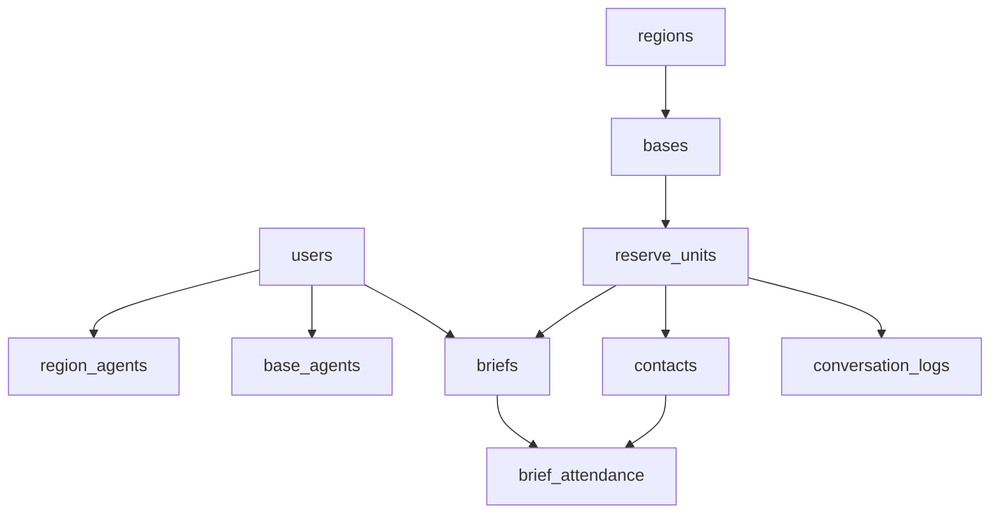

# Agent Tracker v2.0 - Data Model (PostgreSQL)

## 1) ER Model



## 2) SQL DDL (MVP)

```sql
CREATE EXTENSION IF NOT EXISTS "uuid-ossp";

CREATE TYPE user_role AS ENUM ('admin','manager','agent');
CREATE TYPE unit_status AS ENUM ('uncontacted','contacted','scheduling','scheduled','briefed','follow_up_needed','inactive');
CREATE TYPE brief_status AS ENUM ('scheduled','completed','canceled','rescheduled');
CREATE TYPE communication_channel AS ENUM ('phone','email','text','in_person','video','other');
CREATE TYPE outcome_rating AS ENUM ('poor','fair','good','excellent');

CREATE TABLE states (
  id UUID PRIMARY KEY DEFAULT uuid_generate_v4(),
  code VARCHAR(2) NOT NULL UNIQUE,
  name VARCHAR(100) NOT NULL UNIQUE
);

CREATE TABLE users (
  id UUID PRIMARY KEY DEFAULT uuid_generate_v4(),
  google_subject_id TEXT UNIQUE,
  email TEXT NOT NULL UNIQUE,
  first_name TEXT NOT NULL,
  last_name TEXT NOT NULL,
  display_name TEXT NOT NULL,
  role user_role NOT NULL DEFAULT 'agent',
  is_active BOOLEAN NOT NULL DEFAULT TRUE,
  mobile_phone TEXT,
  created_at TIMESTAMPTZ NOT NULL DEFAULT NOW(),
  updated_at TIMESTAMPTZ NOT NULL DEFAULT NOW()
);

CREATE TABLE regions (
  id UUID PRIMARY KEY DEFAULT uuid_generate_v4(),
  name TEXT NOT NULL UNIQUE,
  notes TEXT,
  created_at TIMESTAMPTZ NOT NULL DEFAULT NOW(),
  updated_at TIMESTAMPTZ NOT NULL DEFAULT NOW()
);

CREATE TABLE bases (
  id UUID PRIMARY KEY DEFAULT uuid_generate_v4(),
  region_id UUID NOT NULL REFERENCES regions(id) ON DELETE RESTRICT,
  name TEXT NOT NULL,
  address_line1 TEXT,
  city TEXT,
  state_id UUID REFERENCES states(id),
  postal_code TEXT,
  latitude DOUBLE PRECISION,
  longitude DOUBLE PRECISION,
  notes TEXT,
  created_at TIMESTAMPTZ NOT NULL DEFAULT NOW(),
  updated_at TIMESTAMPTZ NOT NULL DEFAULT NOW(),
  UNIQUE(region_id, name)
);

CREATE TABLE reserve_units (
  id UUID PRIMARY KEY DEFAULT uuid_generate_v4(),
  base_id UUID NOT NULL REFERENCES bases(id) ON DELETE RESTRICT,
  name TEXT NOT NULL,
  unit_type TEXT,
  estimated_personnel_size INT,
  status unit_status NOT NULL DEFAULT 'uncontacted',
  training_days JSONB NOT NULL DEFAULT '[]'::jsonb,
  last_contacted_at TIMESTAMPTZ,
  last_briefed_at TIMESTAMPTZ,
  next_follow_up_at TIMESTAMPTZ,
  notes TEXT,
  created_at TIMESTAMPTZ NOT NULL DEFAULT NOW(),
  updated_at TIMESTAMPTZ NOT NULL DEFAULT NOW(),
  UNIQUE(base_id, name)
);

CREATE TABLE region_agents (
  region_id UUID NOT NULL REFERENCES regions(id) ON DELETE CASCADE,
  user_id UUID NOT NULL REFERENCES users(id) ON DELETE CASCADE,
  assigned_at TIMESTAMPTZ NOT NULL DEFAULT NOW(),
  PRIMARY KEY(region_id, user_id)
);

CREATE TABLE base_agents (
  base_id UUID NOT NULL REFERENCES bases(id) ON DELETE CASCADE,
  user_id UUID NOT NULL REFERENCES users(id) ON DELETE CASCADE,
  assigned_at TIMESTAMPTZ NOT NULL DEFAULT NOW(),
  PRIMARY KEY(base_id, user_id)
);

CREATE TABLE contacts (
  id UUID PRIMARY KEY DEFAULT uuid_generate_v4(),
  reserve_unit_id UUID NOT NULL REFERENCES reserve_units(id) ON DELETE CASCADE,
  full_name TEXT NOT NULL,
  role_title TEXT,
  phone TEXT,
  email TEXT,
  is_career_counselor BOOLEAN NOT NULL DEFAULT FALSE,
  is_scheduling_contact BOOLEAN NOT NULL DEFAULT FALSE,
  notes TEXT,
  created_at TIMESTAMPTZ NOT NULL DEFAULT NOW(),
  updated_at TIMESTAMPTZ NOT NULL DEFAULT NOW()
);

CREATE TABLE conversation_logs (
  id UUID PRIMARY KEY DEFAULT uuid_generate_v4(),
  reserve_unit_id UUID NOT NULL REFERENCES reserve_units(id) ON DELETE CASCADE,
  agent_user_id UUID NOT NULL REFERENCES users(id) ON DELETE RESTRICT,
  contact_id UUID REFERENCES contacts(id) ON DELETE SET NULL,
  happened_at TIMESTAMPTZ NOT NULL,
  contact_person TEXT NOT NULL,
  contact_role TEXT,
  channel communication_channel NOT NULL,
  summary TEXT NOT NULL,
  next_step TEXT,
  follow_up_due_at TIMESTAMPTZ,
  created_at TIMESTAMPTZ NOT NULL DEFAULT NOW()
);

CREATE TABLE briefs (
  id UUID PRIMARY KEY DEFAULT uuid_generate_v4(),
  reserve_unit_id UUID NOT NULL REFERENCES reserve_units(id) ON DELETE RESTRICT,
  base_id UUID NOT NULL REFERENCES bases(id) ON DELETE RESTRICT,
  region_id UUID NOT NULL REFERENCES regions(id) ON DELETE RESTRICT,
  assigned_agent_id UUID NOT NULL REFERENCES users(id) ON DELETE RESTRICT,
  scheduled_at TIMESTAMPTZ NOT NULL,
  completed_at TIMESTAMPTZ,
  status brief_status NOT NULL DEFAULT 'scheduled',
  location_text TEXT,
  attendance_count INT,
  estimated_eligible_lives INT,
  materials_used TEXT,
  outcome_rating outcome_rating,
  reschedule_reason TEXT,
  notes TEXT,
  created_at TIMESTAMPTZ NOT NULL DEFAULT NOW(),
  updated_at TIMESTAMPTZ NOT NULL DEFAULT NOW()
);

CREATE TABLE brief_attendance (
  brief_id UUID NOT NULL REFERENCES briefs(id) ON DELETE CASCADE,
  contact_id UUID NOT NULL REFERENCES contacts(id) ON DELETE CASCADE,
  attended BOOLEAN NOT NULL DEFAULT TRUE,
  PRIMARY KEY(brief_id, contact_id)
);

CREATE TABLE user_state_licenses (
  user_id UUID NOT NULL REFERENCES users(id) ON DELETE CASCADE,
  state_id UUID NOT NULL REFERENCES states(id) ON DELETE CASCADE,
  license_number TEXT,
  expires_on DATE,
  PRIMARY KEY(user_id, state_id)
);

CREATE TABLE google_account_links (
  user_id UUID PRIMARY KEY REFERENCES users(id) ON DELETE CASCADE,
  google_refresh_token_encrypted TEXT,
  granted_scopes TEXT[] NOT NULL DEFAULT '{}',
  connected_at TIMESTAMPTZ NOT NULL DEFAULT NOW()
);

CREATE TABLE synced_calendar_events (
  id UUID PRIMARY KEY DEFAULT uuid_generate_v4(),
  brief_id UUID REFERENCES briefs(id) ON DELETE CASCADE,
  google_event_id TEXT NOT NULL UNIQUE,
  last_sync_at TIMESTAMPTZ NOT NULL DEFAULT NOW()
);

CREATE INDEX idx_bases_region_id ON bases(region_id);
CREATE INDEX idx_units_base_id ON reserve_units(base_id);
CREATE INDEX idx_units_status ON reserve_units(status);
CREATE INDEX idx_conversations_unit_time ON conversation_logs(reserve_unit_id, happened_at DESC);
CREATE INDEX idx_conversations_follow_up ON conversation_logs(follow_up_due_at);
CREATE INDEX idx_briefs_agent_scheduled ON briefs(assigned_agent_id, scheduled_at DESC);
CREATE INDEX idx_briefs_status_scheduled ON briefs(status, scheduled_at);
```

## 3) Derived/Computed Logic

- `last_briefed_at`: max(`briefs.completed_at`) where status = `completed` for each unit.
- `units_not_briefed_6_months`: derived report view for units with no completed brief in 180 days.
- `overdue_follow_up`: conversations where `follow_up_due_at < now()` and unresolved.

## 4) Migration Notes from v2.0 HTML Model

- Split old `UNITS` table into `regions`, `bases`, `reserve_units`.
- Replace boolean role flags with `user_role` enum.
- Keep `states` as shared reference.
- Carry over attendance and relationship depth using `brief_attendance` and assignments tables.
