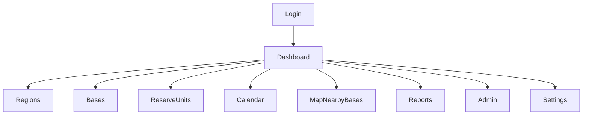

# Agent Tracker v2.0 - UI/UX Specification

## UX Principles

- Fast data entry first.
- Dense information with clear hierarchy.
- Status and overdue indicators instantly scannable.
- Reusable components over custom one-offs.

## Primary Screens

1. Login (Google OAuth)
2. Dashboard
3. Regions list/detail
4. Bases list/detail
5. Reserve units list/detail
6. Conversation log list/add/edit
7. Brief scheduling + brief detail
8. Calendar (month/week)
9. Map / Nearby bases
10. Agent performance
11. Reports
12. Admin management
13. Settings

## Navigation Model

## Reusable Components

- `SummaryCard`
- `StatusBadge`
- `OverdueChip`
- `QuickActionButton`
- `FilterBar`
- `SearchSortHeader`
- `DataTableCard`
- `EmptyStatePanel`
- `ValidationMessage`

## Status Color Spec

- Uncontacted: neutral gray
- Contacted: blue
- Scheduling: amber
- Scheduled: orange
- Briefed: green
- Follow-Up Needed: red
- Inactive: muted slate

## Data Entry Optimizations

- Sticky action bar on detail screens (`Log Contact`, `Schedule Brief`).
- Default values and recent-value autofill for repetitive fields.
- Keyboard-first web forms with tab order tuning.
- Mobile quick forms with minimal required fields then expand.

## Empty States and Validation

- Every list has empty-state CTA.
- Required fields highlighted inline with actionable messages.
- Date validation prevents impossible brief/follow-up combinations.
