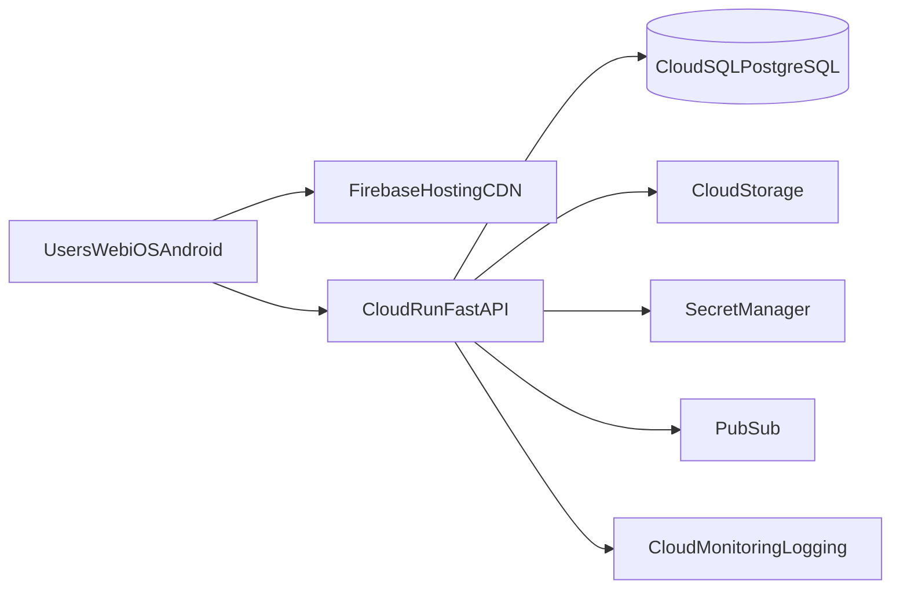

# Agent Tracker v2.0 - Deployment and Infrastructure (GCP)

## Topology

## Core Services

- Cloud Run: API and background worker services.
- Cloud SQL (PostgreSQL): primary relational datastore.
- Cloud Storage: uploaded files/materials/exports.
- Secret Manager: OAuth credentials and API keys.
- Artifact Registry: container images.
- Firebase Hosting (+ CDN): Flutter web hosting.
- Cloud Monitoring/Logging: observability.

## Environments

- `dev`: non-prod project, relaxed autoscaling.
- `staging`: prod-like configs, release candidate validation.
- `prod`: high availability, strict IAM, full alerts.

## CI/CD

- Trigger on main branch merges.
- Steps:
  1. lint/test backend + Flutter
  2. build artifacts
  3. run DB migrations (Alembic)
  4. deploy Cloud Run
  5. smoke test

## Security

- Private service-to-service access where possible.
- Least-privilege IAM roles.
- All secrets rotated and versioned in Secret Manager.
- Audit logs retained per compliance policy.

## Cost Envelope (early stage 10-50 users)

- Cloud Run + SQL + basic Maps usage: low-to-mid hundreds USD/month, scaling with API volume and Maps calls.
- Optimize by caching distance/geocode and batching sync/export jobs.
